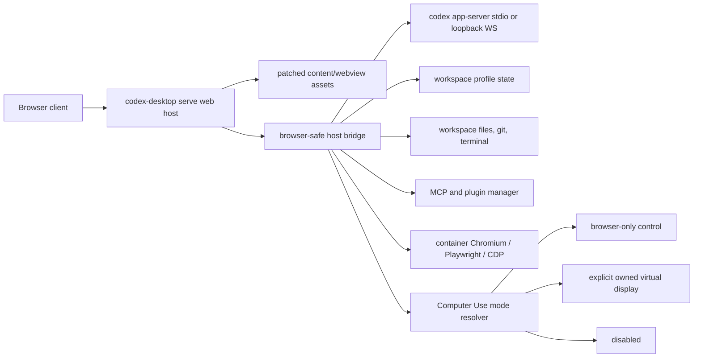

# Codex Desktop Devcontainer Real Web Architecture Design

## Status

Draft for issue #9. This spec replaces the Phase 1 noVNC compatibility mindset with a real browser architecture. It does not remove the native Electron app path, and it does not treat VNC, xpra, or Xvfb as the final user experience.

## Problem

Issue #9 asks for Codex Desktop Linux to run as a portable app surface inside a DevPod or devcontainer, then be opened from a browser over a safe local or forwarded port. The target workflow is:

```bash
brew install codex-desktop-linux
codex-desktop serve --workspace /workspace --profile /workspace/.codex-desktop
```

The current repository can already run the real Electron app inside a container with Xvfb/noVNC. That proves packaging, login, profile persistence, and DevPod forwarding, but the visual experience is a remote-display workaround. The real architecture must make the browser a first-class client while the devcontainer owns files, git state, terminals, Codex profile state, Browser Use sidecars, and any safe Computer Use target.

## Current Repo Facts

- `scripts/lib/webview-install.sh` copies upstream `app.asar` webview files into `codex-app/content/webview/`.
- `launcher/start.sh.template` serves those assets from `127.0.0.1:$CODEX_LINUX_WEBVIEW_PORT`, validates `index.html`, and then launches Electron with `ELECTRON_RENDERER_URL`.
- `docs/webview-server-evaluation.md` correctly identifies the extracted webview payload as a static bundle with hashed relative assets, but its command detail is stale: current launcher uses `launcher/webview-server.py`, not raw `python3 -m http.server`.
- Renderer assets are not a standalone web app today. They expect Electron main/preload services for global state, settings, IPC, launch actions, file manager actions, updater hooks, Chrome status, Browser Use approvals, and Computer Use gates.
- Current devcontainer env markers such as `CODEX_DESKTOP_DEVCONTAINER_MODE=1`, `CODEX_BROWSER_USE_BROWSER_COMMAND=chromium`, and `CODEX_COMPUTER_USE_BROWSER_ONLY=1` are documented and smoke-tested, but not enforced by shared runtime policy.

## External Reference Points

- T3 Code is a public TypeScript monorepo and describes itself as a minimal web GUI for coding agents. Its remote model has a CLI `t3 serve` that starts a headless server, prints connection and pairing data, and lets browser or desktop clients connect to that backend. The remote host owns projects, files, git state, terminals, and provider sessions.
- T3 Code pairing is session-oriented: an owner token pairs a device, then future access uses authenticated sessions. It also calls out private network and HTTPS/WSS constraints instead of pretending a public unauthenticated WebSocket is safe.
- OpenAI Codex `app-server` is the official rich-client protocol surface for authentication, conversation history, approvals, and streamed agent events. It speaks JSON-RPC over stdio and has an experimental WebSocket transport with auth flags. OpenAI docs explicitly warn that non-loopback WebSocket listeners must not be exposed without auth.
- OpenAI Codex browser docs split browser features: in-app browser/Browser Use for local or public pages without login, Chrome extension for signed-in browser/profile workflows.
- OpenAI Computer Use docs frame desktop control as sensitive because it can affect state outside the workspace. In devcontainer mode that risk maps directly to "never control the physical host desktop."

References:

- Issue #9: https://github.com/joshyorko/codex-desktop-linux/issues/9
- T3 Code repository: https://github.com/pingdotgg/t3code
- T3 Code remote access: https://raw.githubusercontent.com/pingdotgg/t3code/main/REMOTE.md
- OpenAI Codex app-server: https://developers.openai.com/codex/app-server
- OpenAI Codex in-app browser and Browser Use: https://developers.openai.com/codex/app/browser
- OpenAI Codex Computer Use: https://developers.openai.com/codex/app/computer-use

## Design Goal

Build a `codex-desktop serve` mode that starts a devcontainer-local web host and exposes a browser client over a loopback-only port by default. The browser client should reuse the patched Codex Desktop webview assets where feasible, but talk to a new browser-safe host bridge instead of Electron main/preload. The native Electron launch path remains intact.

Final target: zero permanent feature loss. Every desktop feature either works through the web host bridge, is backed by the existing Codex app-server, or is explicitly listed as a temporary web-mode gap with diagnostics and an implementation task. No feature should disappear from native Linux.

## Architecture Decision

Use the renderer-extraction plus host-bridge architecture.



This matches the important T3 Code lesson: server owns runtime state; clients are replaceable. For this repo, the "server" is not a new SaaS. It is a local process inside the devcontainer, reachable through DevPod or SSH-style port forwarding.

## Alternatives Considered

### 1. Recommended: Webview Assets Plus Host Bridge

Serve the existing patched webview bundle, inject a web-mode bootstrap, and replace Electron IPC/preload calls with a typed WebSocket/HTTP host bridge. The host bridge owns app-server startup, profile paths, settings, filesystem, terminals, plugin lifecycle, Browser Use sidecars, and Computer Use policy.

Benefits:

- Best path to zero feature loss because it keeps the upstream Codex Desktop UI assets.
- Keeps native Electron path unchanged.
- Incremental: bridge APIs can be inventoried and implemented one-by-one.
- Fits DevPod/local port-forwarding and mobile browser clients.

Risks:

- Minified renderer and preload assumptions may drift upstream.
- Needs a real bridge contract and compatibility tests, not ad hoc patches.
- Some Electron-only behavior may need server-side equivalents.

### 2. New T3-Style Web Shell Over Codex App-Server

Build a fresh web UI around `codex app-server`, terminal, file, git, and browser services.

Benefits:

- Clean architecture and less upstream minified patching.
- Easier to make web-native from day one.

Risks:

- Violates the zero-feature-loss target at the start.
- Recreates Codex Desktop UI and product behavior from scratch.
- Higher chance of drifting from upstream app semantics.

### 3. Hybrid Electron Companion

Run Electron minimally for native host/session behavior and expose a browser surface around it.

Benefits:

- Preserves the most existing desktop behavior early.
- Could bridge hard-to-recreate main-process functions.

Risks:

- Still couples web mode to a GUI runtime.
- Harder to make cloud-native and portable.
- Keeps the architecture too close to the noVNC compatibility harness.

## Serve Command Contract

`codex-desktop serve` runs inside the workspace container.

Default behavior:

```bash
codex-desktop serve \
  --workspace /workspace \
  --profile /workspace/.codex-desktop \
  --bind 127.0.0.1 \
  --port 3773
```

It starts:

- static asset serving for `content/webview`;
- a browser-safe host bridge under the same origin;
- a managed `codex app-server` child process over stdio by default;
- a per-profile plugin and MCP runtime;
- Browser Use sidecar if available;
- Computer Use policy guard before any desktop backend starts.

It prints:

- local URL;
- DevPod/port-forward guidance;
- one-time pairing token or local session bootstrap token;
- profile path;
- active Browser Use and Computer Use modes;
- doctor summary.

Non-loopback bind requires explicit opt-in:

```bash
codex-desktop serve --bind 0.0.0.0 --require-token
```

If `--bind` is not loopback and token auth is not enabled, startup must fail.

## Host Bridge

The host bridge is the browser replacement for Electron main/preload.

Initial responsibilities:

- global state: `get-global-state`, `set-global-state`, settings persistence;
- app-server lifecycle: spawn, initialize, restart, health, version schema;
- conversation stream proxy: typed JSON-RPC requests and notifications;
- approvals: command/file/browser/computer permission prompts and decisions;
- workspace services: file open, file reveal, terminal creation, git status, diagnostics;
- plugin services: bundled plugin cache, MCP config, plugin enable/disable status;
- URL/deep-link handling: browser-safe replacement for launch-action socket behavior;
- updater services: web mode must preserve the native updater surface by reporting status, checking readiness, and either invoking the existing package/update helper inside the devcontainer profile or returning an explicit unsupported-by-environment diagnostic. Any missing install action is a temporary web-mode gap, not accepted feature loss.

Implementation shape:

- Generate TypeScript schemas from `codex app-server generate-ts` during build or first run.
- Add a repo-owned bridge schema for Electron-equivalent host services.
- Use one WebSocket for events and request/response bridge traffic, plus HTTP for health, assets, and diagnostics.
- Keep app-server on stdio or a loopback authenticated WebSocket behind the web host. Do not expose raw app-server remotely as the public API.

## Browser Client Bootstrap

Directly opening `content/webview/index.html` in a browser is not enough. Web mode needs a bootstrap script injected before app startup that provides the host APIs the renderer expects.

The implementation should:

- detect `CODEX_DESKTOP_WEB_MODE=1` at install or serve time;
- inject a stable `codex-web-host.js` before hashed renderer chunks;
- implement the current Electron/preload message surface using the host bridge;
- keep patches fail-soft but report missing bridge needles as a web-mode blocking failure;
- keep native Electron preload untouched.

First inventory task:

- list every renderer call into Electron, VS Code API shims, `dispatchHostMessage`, `dispatchMessage`, `ipcRenderer`, and global state;
- classify each call as `bridge-now`, `bridge-deferred`, `native-only-status`, or `delete-from-web-mode-not-allowed`.

## Profile And Identity

One workspace gets one stable web-host profile.

Default paths:

```text
/workspace/.codex-desktop/profile
/workspace/.codex-desktop/browser
/workspace/.codex-desktop/run
/workspace/.codex-desktop/logs
```

Persist:

- Codex auth and app profile state;
- app-server session state;
- MCP/plugin config;
- Browser Use profile and CDP socket info;
- pairing sessions and revocation list;
- host identity metadata.

Never bake tokens, profile directories, pairing secrets, or device keys into container images.

## Browser Use Mode

Native desktop mode keeps current behavior: in-app browser, Chrome extension, local browser profiles, and native messaging can operate against the user's real desktop environment.

Devcontainer web mode defaults to container-local browser control:

```text
browser_mode = container-chromium
```

Allowed modes:

- `container-chromium`: launch Chromium inside the devcontainer with a profile under `--profile`.
- `playwright-cdp`: use a Playwright-owned browser or attach to an explicit CDP endpoint.
- `disabled`: Browser Use is unavailable and diagnostics say why.

Disallowed by default in devcontainer web mode:

- host Chrome profile discovery;
- host native messaging manifests;
- assumptions that the user's Bluefin/work laptop browser profile exists inside the container;
- physical-host browser control. Future signed-in browser work must still run through a container-owned browser profile or a separately designed remote-browser connector that cannot control the user's physical desktop by default.

Minimum interface:

```text
CODEX_BROWSER_MODE=container-chromium
CODEX_BROWSER_PROFILE_DIR=/workspace/.codex-desktop/browser
CODEX_BROWSER_CDP_ENDPOINT=http://127.0.0.1:<port>
CODEX_BROWSER_USE_SOCKET_DIR=/workspace/.codex-desktop/run/browser-use
```

## Computer Use Mode

Native desktop mode keeps current Linux Computer Use behavior.

Devcontainer web mode must never try to control the physical host desktop. It must resolve mode before the Rust backend hydrates session-bus state, probes portals, calls compositor APIs, or touches `ydotool`.

Default:

```text
computer_control = browser-only
```

Modes:

- `browser-only`: Computer Use desktop tools do not register, or each returns a clear disabled-by-mode result pointing to Browser Use. This is the default for real web architecture.
- `virtual-display`: explicit future mode only. It may target an owned container display if the process created and can prove ownership of that display. It must not use host DBus, host portals, host compositor APIs, or host `ydotool` sockets.
- `disabled`: no Computer Use tools.
- `host-linux`: native install only, never devcontainer default.

Xvfb/noVNC/xpra stay Phase 1 compatibility only. A future Computer Use `virtual-display` backend must be separate, explicitly owned by the web host, and not used as the browser UI transport.

## Security Model

Defaults:

- bind only to `127.0.0.1`;
- expect DevPod, SSH, or local port-forwarding;
- require explicit opt-in for non-loopback listeners;
- use high-entropy one-time pairing tokens for new browser clients;
- exchange pairing token for a revocable session;
- store sessions in the profile;
- reject unknown origins;
- keep raw app-server behind the host bridge;
- prefer `--ws-token-file` or equivalent secret files over command-line tokens;
- log the effective bind, auth, and origin policy at startup.

The web host may support Tailscale, HTTPS, or custom tunnel providers in a future milestone, but the first implementation should keep the trusted local-forward model boring and auditable.

## Diagnostics

Add:

```bash
codex-desktop doctor --mode devcontainer
codex-desktop serve --doctor
```

Checks:

- workspace path exists and is writable;
- profile path exists, is writable, and is not image-baked;
- listener is loopback unless explicitly configured otherwise;
- web host health, asset integrity, and bridge schema version;
- app-server version, transport, auth, and initialized state;
- CLI auth status and login guidance;
- Browser Use mode, Chromium/Playwright/CDP status, profile path;
- Computer Use mode and exact target boundary;
- plugin/MCP availability;
- Remote Connections/app host visibility where server-side enrollment allows it;
- warnings for feature gates controlled by OpenAI account/workspace/admin policy.

Diagnostics must avoid native-host fix advice in devcontainer browser-only mode. For example, it should not recommend host `ydotool`, GNOME extensions, or portal setup when those paths are intentionally disabled.

## Milestones

### M0: Bridge Inventory

- Build a script that scans extracted webview and preload bundles for host/Electron APIs.
- Produce a bridge inventory report in `dist-next/web-mode/bridge-inventory.json`.
- Classify every dependency before implementation starts.

Acceptance:

- report exists for current upstream bundle;
- report lists global state, host messages, app-server calls, Browser Use hooks, Computer Use gates, and update hooks;
- missing classification fails CI for web-mode work.

### M1: Serve Skeleton

- Add `codex-desktop serve` entrypoint.
- Serve patched webview assets and bridge bootstrap from loopback.
- Print local URL and profile paths.
- Enforce listener policy.

Acceptance:

- DevPod/local port-forward opens a browser page from the devcontainer;
- no Electron process is required for the browser client;
- non-loopback without auth fails.

### M2: App-Server Bridge

- Start `codex app-server` behind the host bridge.
- Proxy initialize, thread, turn, approval, and streaming events.
- Generate and pin matching schemas.

Acceptance:

- browser client can start or resume a Codex thread against `/workspace`;
- command approvals and streamed output appear in UI;
- app-server is not exposed as unauthenticated public WebSocket.

### M3: Profile Persistence

- Persist profile, sessions, plugins, MCP config, and browser profile under `--profile`.
- Preserve per-workspace identity across restarts.

Acceptance:

- stop/start keeps login and session state;
- cloned container image does not contain secrets;
- doctor reports profile ownership and persistence.

### M4: Container Browser Use

- Launch or attach to container-local Chromium through Playwright/CDP.
- Store browser profile under `--profile`.
- Disable host Chrome/native-messaging discovery by default in devcontainer mode.

Acceptance:

- Browser Use can open a local dev server in the container and take a screenshot;
- diagnostics distinguish `container-chromium`, `playwright-cdp`, and `disabled`;
- no host Chrome profile path is scanned.

### M5: Computer Use Guard

- Add shared mode resolver.
- Gate Computer Use plugin registration or Rust backend startup before desktop probing.
- Add browser-only disabled responses and diagnostics.

Acceptance:

- devcontainer default cannot call host desktop, portals, compositor APIs, or `ydotool`;
- browser-only mode points users to Browser Use;
- native Linux mode behavior remains unchanged.

### M6: Feature Parity Audit

- Run a checklist against native Electron features: threads, projects, settings, remote Connections visibility, Browser Use, Computer Use policy, plugins, terminals, files, git, MCP, and updater status.
- Track any temporary web-mode gaps as explicit issues.

Acceptance:

- screenshot shows working browser-hosted Codex Desktop UI in the devcontainer;
- doctor output proves workspace/profile/tool modes;
- no known silent feature disappearance.

## Test Plan

- Unit tests for mode resolver: native, devcontainer browser-only, virtual-display, disabled.
- Unit tests for listener policy: loopback default, non-loopback requires auth.
- Bridge schema tests against generated `codex app-server` schema.
- Web asset smoke test: boot host, fetch `index.html`, verify bootstrap injection, verify health.
- Playwright smoke test through forwarded URL with screenshot artifact.
- Dagger/devcontainer smoke test on `ghcr.io/joshyorko/ror:latest`.
- Browser Use smoke test with container Chromium/CDP against a local test page.
- Computer Use negative smoke test proving host desktop APIs are not touched in devcontainer mode.
- Native regression smoke test proving current Electron launcher still works.

## Risks And Mitigations

- Upstream renderer drift: bridge inventory and web-mode CI fail fast when host API needles move.
- App-server WebSocket maturity: use stdio behind the host bridge first; only use authenticated loopback WS when needed.
- OAuth/login from browser: support CLI login first, then add browser/device login only after bridge auth is stable.
- Remote Connections server-side controls: preserve UI and state where possible, but never bypass OpenAI account/workspace/admin gates.
- Tool confusion: diagnostics must say which machine each tool controls.
- Scope creep into a full IDE rewrite: reject new UI shell until the webview bridge path proves impossible.

## Open Questions

- Which Electron host calls are required before the first usable login/thread screen?
- Does the upstream renderer already have enough app-server client logic to reuse, or does the bridge need to translate more of the protocol?
- Which profile paths are required for stable Remote Connections identity in web mode?
- Should virtual-display Computer Use exist before Browser Use is solid, or stay deferred?
- Which exact Rust migration signal should trigger replacing the first Node web host? Recommendation: use managed Node for fast bridge iteration, then consider Rust once the bridge contract stabilizes and startup/runtime costs are measured.

## Recommendation

Proceed with M0 and M1 next. Do not invest more in noVNC except to keep the Phase 1 proof and screenshot harness alive. The first real implementation task is not "make VNC prettier"; it is "inventory and replace Electron host dependencies with a browser-safe host bridge."
